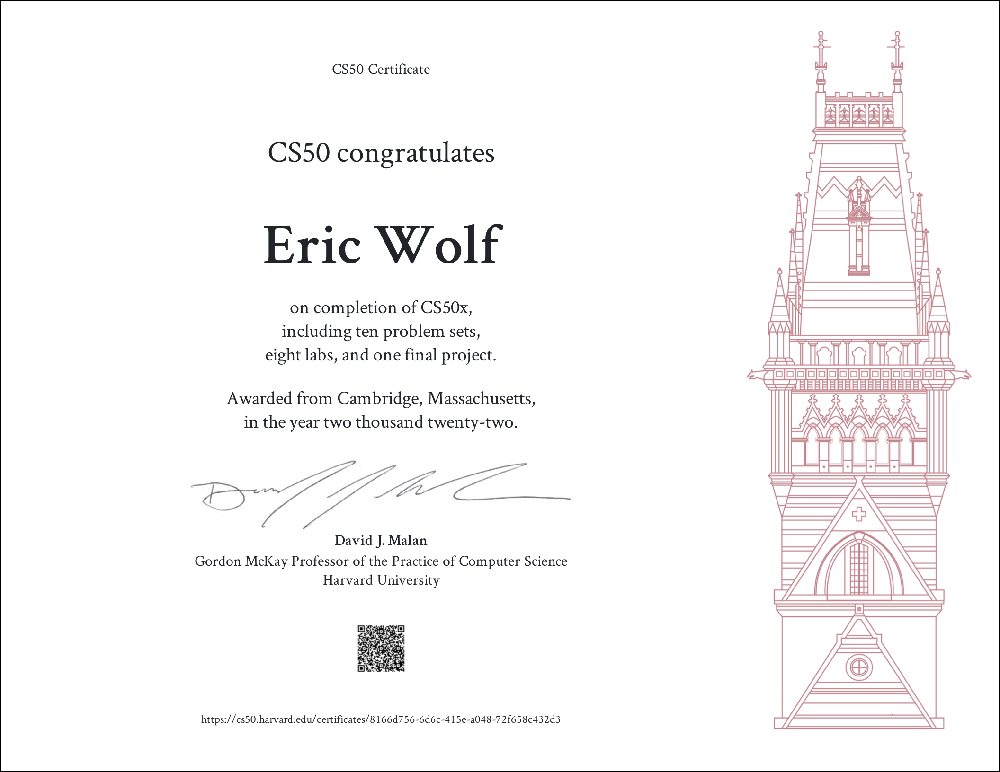

[<- Back to main](https://github.com/GrandEchoWhiskey)

<a href="https://cs50.harvard.edu/ai/2020">
   
</a>

<h1 align="center">CS50’s Introduction to Computing Science</h1>

 

#### Free HarvardX course on [cs50.harvard.edu/x/2022][harvard_link] 
Certificate key: [8166d756-6d6c-415e-a048-72f658c432d3][certificate_link]

---

## Problem sets (P) & Labs (L):
|  | Name | Description | Technology
:---: | :--- | :--- | :---:
P1 | [Hello][hello_link] | Says Hello to you. | [![C][c_img]](#)
P1 | [Mario (More)][mario_link] | Creates a Mario pyramid in terminal. | [![C][c_img]](#)
P1 | [Credit][credit_link] | Checks a given creditcard if is valid. | [![C][c_img]](#)
L2 | [Scrabble][scrabble_link] | Compares letters used by two players, and their value | [![C][c_img]](#)
P2 | [Readability][readability_link] | Grades the readability of a text. | [![C][c_img]](#)
P2 | [Substitution][substitution_link] | Substitution cipher. | [![C][c_img]](#)
L3 | [Sort][sort_link] | Anwsers of what sorting algorthm was used | 
P3 | [Plurality][plurality_link] | Plurality election. | [![C][c_img]](#)
P3 | [Tideman][tideman_link] | Tideman election. | [![C][c_img]](#)
L4 | [Volume][volume_link] | Modifies the volume of an .wav audio file | [![C][c_img]](#)
P4 | [Filter (More)][filter_link] | Filters for .bmp images. | [![C][c_img]](#)
P4 | [Recover][recover_link] | Recovers JPEGs from forensic images. | [![C][c_img]](#)
L5 | [Inheritance][inheritance_link] | Simulates the inheritance of blood types for each member of a family | [![C][c_img]](#)
P5 | [Speller][speller_link] | Checks spellings in text. | [![C][c_img]](#)
L6 | [World Cup][worldcup_link] | Simulates multiple FIFA World Cups | [![Python][py_img]](#)
P6 | [Hello][hello_py_link] | Says Hello to you. | [![Python][py_img]](#)
P6 | [Mario (More)][mario_py_link] | Creates a Mario pyramid in terminal. | [![Python][py_img]](#)
P6 | [Credit][credit_py_link] | Checks a given creditcard if is valid. | [![Python][py_img]](#)
P6 | [Readability][readability_py_link] | Grades the readability of a text. | [![Python][py_img]](#)
P6 | [DNA][dna_link] | Person identification based on their DNA. | [![Python][py_img]](#)
L7 | [Songs][songs_link] | Answer questions about a database of songs | [![SQL][sql_img]](#)
P7 | [Movies][movies_link] | Anwser questions about a DB of movies | [![SQL][sql_img]](#)
P7 | [Fiftyville][fiftyville_link] | Solve a mystery | [![SQL][sql_img]](#)
L8 | [Trivia][trivia_link] | A webpage that lets users answer trivia questions | [![HTML][html_img]![CSS][css_img]](#)
P8 | [Homepage][homepage_link] | Simple homepage. | [![JavaScript][js_img]![HTML][html_img]![CSS][css_img]](#)
L9 | [Birthdays][birthdays_link] | A web application to keep track of friends’ birthdays | [![Python][py_img]![HTML][html_img]![CSS][css_img]](#)
P9 | [Finance][finance_link] | A website via wich users can "buy" and "sell" stocks. | [![Python][py_img]![HTML][html_img]](#)
  

  
---
  

<!-- Links -->

[harvard_link]:     https://cs50.harvard.edu/x/2022
[certificate_link]: https://certificates.cs50.io/8166d756-6d6c-415e-a048-72f658c432d3

[hello_link]:           https://github.com/GrandEchoWhiskey/harvard-cs50-x-projects/tree/main/pset-1-hello
[mario_link]:           https://github.com/GrandEchoWhiskey/harvard-cs50-x-projects/tree/main/pset-1-mario-more
[credit_link]:          https://github.com/GrandEchoWhiskey/harvard-cs50-x-projects/tree/main/pset-1-credit
[readability_link]:     https://github.com/GrandEchoWhiskey/harvard-cs50-x-projects/tree/main/pset-2-readability
[substitution_link]:    https://github.com/GrandEchoWhiskey/harvard-cs50-x-projects/tree/main/pset-2-substitution
[plurality_link]:       https://github.com/GrandEchoWhiskey/harvard-cs50-x-projects/tree/main/pset-3-plurality
[tideman_link]:         https://github.com/GrandEchoWhiskey/harvard-cs50-x-projects/tree/main/pset-3-tideman
[filter_link]:          https://github.com/GrandEchoWhiskey/harvard-cs50-x-projects/tree/main/pset-4-filter-more
[recover_link]:         https://github.com/GrandEchoWhiskey/harvard-cs50-x-projects/tree/main/pset-4-recover
[speller_link]:         https://github.com/GrandEchoWhiskey/harvard-cs50-x-projects/tree/main/pset-5-speller
[hello_py_link]:        https://github.com/GrandEchoWhiskey/harvard-cs50-x-projects/tree/main/pset-6-sentimental-hello
[mario_py_link]:        https://github.com/GrandEchoWhiskey/harvard-cs50-x-projects/tree/main/pset-6-sentimental-mario-more
[credit_py_link]:       https://github.com/GrandEchoWhiskey/harvard-cs50-x-projects/tree/main/pset-6-sentimental-credit
[readability_py_link]:  https://github.com/GrandEchoWhiskey/harvard-cs50-x-projects/tree/main/pset-6-sentimental-readability
[dna_link]:             https://github.com/GrandEchoWhiskey/harvard-cs50-x-projects/tree/main/pset-6-dna
[movies_link]:          https://github.com/GrandEchoWhiskey/harvard-cs50-x-projects/tree/main/pset-7-movies
[fiftyville_link]:      https://github.com/GrandEchoWhiskey/harvard-cs50-x-projects/tree/main/pset-7-fiftyville
[homepage_link]:        https://github.com/GrandEchoWhiskey/harvard-cs50-x-projects/tree/main/pset-8-homepage
[finance_link]:         https://github.com/GrandEchoWhiskey/harvard-cs50-x-projects/tree/main/pset-9-finance

<!-- Labs -->
[scrabble_link]:        https://github.com/GrandEchoWhiskey/harvard-cs50-x-projects/tree/main/lab-2-scrabble
[sort_link]:            https://github.com/GrandEchoWhiskey/harvard-cs50-x-projects/tree/main/lab-3-sort
[volume_link]:          https://github.com/GrandEchoWhiskey/harvard-cs50-x-projects/tree/main/lab-4-volume
[inheritance_link]:     https://github.com/GrandEchoWhiskey/harvard-cs50-x-projects/tree/main/lab-5-inheritance
[worldcup_link]:        https://github.com/GrandEchoWhiskey/harvard-cs50-x-projects/tree/main/lab-6-world-cup
[songs_link]:           https://github.com/GrandEchoWhiskey/harvard-cs50-x-projects/tree/main/lab-7-songs
[trivia_link]:          https://github.com/GrandEchoWhiskey/harvard-cs50-x-projects/tree/main/lab-8-trivia
[birthdays_link]:       https://github.com/GrandEchoWhiskey/harvard-cs50-x-projects/tree/main/lab-9-birthdays

[c_img]: https://github.com/GrandEchoWhiskey/grandechowhiskey/blob/main/icons/programming/c.png
[py_img]: https://github.com/GrandEchoWhiskey/grandechowhiskey/blob/main/icons/programming/python.png
[sql_img]: https://github.com/GrandEchoWhiskey/grandechowhiskey/blob/main/icons/programming/sql.png
[js_img]: https://github.com/GrandEchoWhiskey/grandechowhiskey/blob/main/icons/programming/js.png
[html_img]: https://github.com/GrandEchoWhiskey/grandechowhiskey/blob/main/icons/programming/html.png
[css_img]: https://github.com/GrandEchoWhiskey/grandechowhiskey/blob/main/icons/programming/css.png
